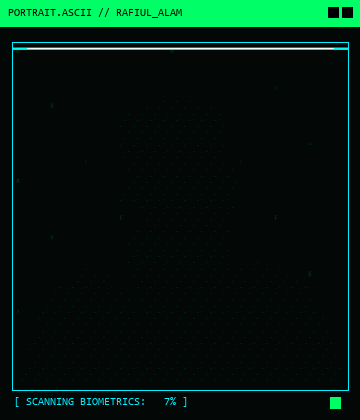

<div align="center">

  <a href="https://github.com/Alamrafiulll">
    
  </a>

  <br /><br />

  

  <br />

  <a href="https://rafiulalam.xyz">
    
  </a>
  <a href="https://www.linkedin.com/in/rafiul-alam-4638212b8">
    
  </a>
  <a href="mailto:rafiulalamrifat99@gmail.com">
    
  </a>

</div>

<br />

## `terminal://profile --whoami`

<div align="center">
  <table>
    <tr>
      <td width="40%" valign="top">
        
      </td>
      <td width="60%" valign="top">
        
      </td>
    </tr>
  </table>
</div>

<div align="center">
  
</div>

## `cyberdeck://toolkit`

<div align="center">
  <a href="https://skillicons.dev">
    
  </a>
</div>

```text
[ WEB + FRONTEND   ]  Next.js, React 19, TypeScript, JavaScript, HTML5, CSS3, Tailwind CSS
[ BACKEND + MOBILE ]  Python, Java, FastAPI, Flask, REST APIs, Firebase, Flutter, Dart, React Native
[ AI ENGINEERING   ]  Vercel AI SDK, OpenAI + Gemini APIs, Hugging Face, Qwen, Zod, AST analysis
[ DATA + CLOUD     ]  PostgreSQL, Supabase RLS, MySQL, Azure, Docker, Vercel, Firebase Cloud Messaging
[ DEV + SECURITY   ]  Git, GitHub, CI/CD, HMAC authentication, token-bucket rate limiting, n8n, Figma
```

<div align="center">
  
</div>

## `archive://selected-projects`

<div align="center">
  <code>[ PROJECT_ARCHIVE ] :: selected builds and live deployments</code>
</div>

| Terminal command | Output | Modules | Access |
| :-- | :-- | :-- | :-- |
| [`$ ./rolefit-ai --match=resume:job`](https://github.com/Alamrafiulll/AI-Powered-Resume-checker-) | `> AI role coach + resume-to-job matching` | `TypeScript` `Next.js` `AI` | <a href="https://rolefit-ai-psi.vercel.app"></a><br/><a href="https://github.com/Alamrafiulll/AI-Powered-Resume-checker-"></a> |
| [`$ ./agentic-crm --sync=lead-intent`](https://github.com/Alamrafiulll/AI-integrated-CRM-system-) | `> Extracts intent and updates lead pipelines` | `TypeScript` `Next.js` `Supabase` | <a href="https://agentic-crm-azure.vercel.app"></a><br/><a href="https://github.com/Alamrafiulll/AI-integrated-CRM-system-"></a> |
| [`$ ./taskmate --listen --schedule`](https://github.com/Alamrafiulll/Taskmate-voice-integrated-personal-assistant-) | `> Voice-operated personal scheduling assistant` | `Flutter` `Gemini API` `Dart` | <a href="https://github.com/Alamrafiulll/Taskmate-voice-integrated-personal-assistant-"></a> |
| [`$ ./neurocost --analyze=market-pricing`](https://github.com/Alamrafiulll/verceldeploymentofaipricer) | `> AI pricing and market intelligence system` | `Python` `Machine Learning` | <a href="https://neurocost-2enx.vercel.app"></a><br/><a href="https://github.com/Alamrafiulll/verceldeploymentofaipricer"></a> |
| [`$ ./stem-mentorship --connect=student:mentor`](https://github.com/Alamrafiulll/University-STEM-Mentorship-and-Collaboration-Portal) | `> Student-to-mentor collaboration platform` | `TypeScript` `Next.js` `React` | <a href="https://university-stem-mentorship-and-coll.vercel.app"></a><br/><a href="https://github.com/Alamrafiulll/University-STEM-Mentorship-and-Collaboration-Portal"></a> |

<div align="center">
  
</div>

## `telemetry://github`

<div align="center">
  <a href="https://github.com/Alamrafiulll">
    
  </a>
  <a href="https://github.com/Alamrafiulll">
    
  </a>

  <br /><br />

  
</div>

<br />

<div align="center">
  
</div>

## `contribution://snake-grid`

<div align="center">
  
  <br />
  <code>[ ARCADE_SNAKE_PROTOCOL ] // solid cyan cyber snake // devouring green commits // shattering blocks</code>
</div>

<br />

<div align="center">
  <code>[ session closed ] // thanks for stopping by</code>
</div>
